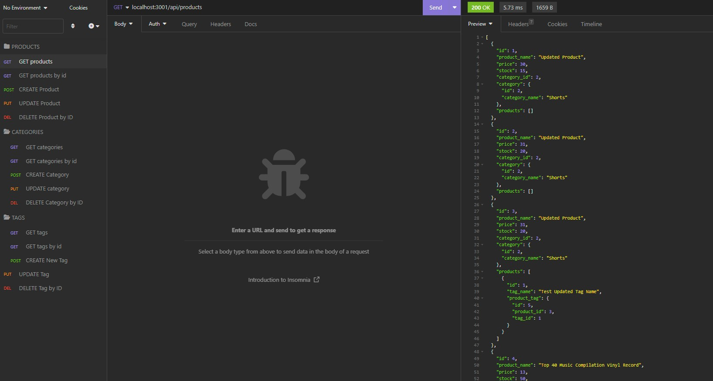

# E-Commerce Application

## Description
This is an E-Commerce Application that allows users to browse and purchase products online. It provides a user-friendly interface for customers to explore various products, view detailed product information, add products to their shopping cart, and complete the checkout process. The application also includes an admin interface for managing products, categories, and tags.
## Table of Contents
- [Installation](#installation)
- [Usage](#usage)
- [License](#license)
- [Badges](#badges)
- [Tests](#tests)
- [Questions](#questions)

## Installation
To get started with the application, follow these steps:

Clone the repository and navigate to the project directory.
Install the necessary dependencies using npm install.
Set up the database connection in the configuration file.
Run the database migrations and seed the initial data.
Start the server using npm start or node index.js.
Access the application in your web browser at http://localhost:3001.

## Usage
You can view a video demonstration of how to use this application [here.](https://drive.google.com/file/d/1Q-TgBQcRocPgdXuHjEjPB00-bTLTPiN7/view)  

    

## License
MIT License

## Badges

## Tests
N/A 

## Questions
GitHub Profile: [https://github.com/Daniel-Covington/E-commerce-Back-End-API](https://github.com/Daniel-Covington/E-commerce-Back-End-API) 
For further questions, you can reach me at danielmcovington@gmail.com

